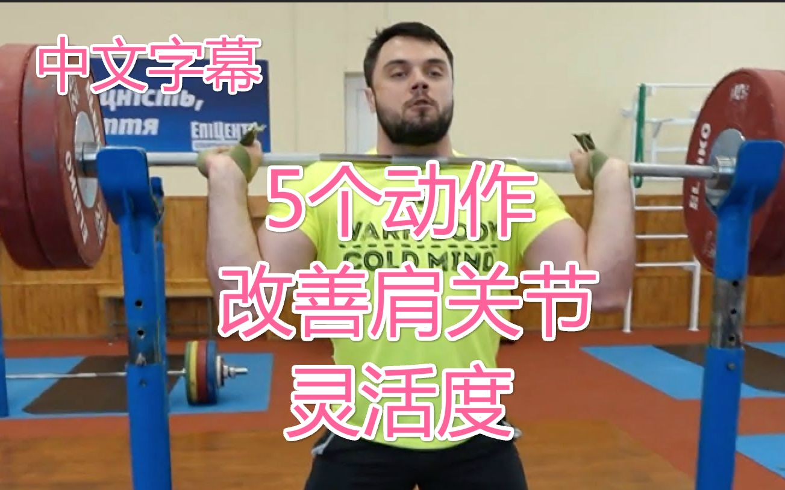
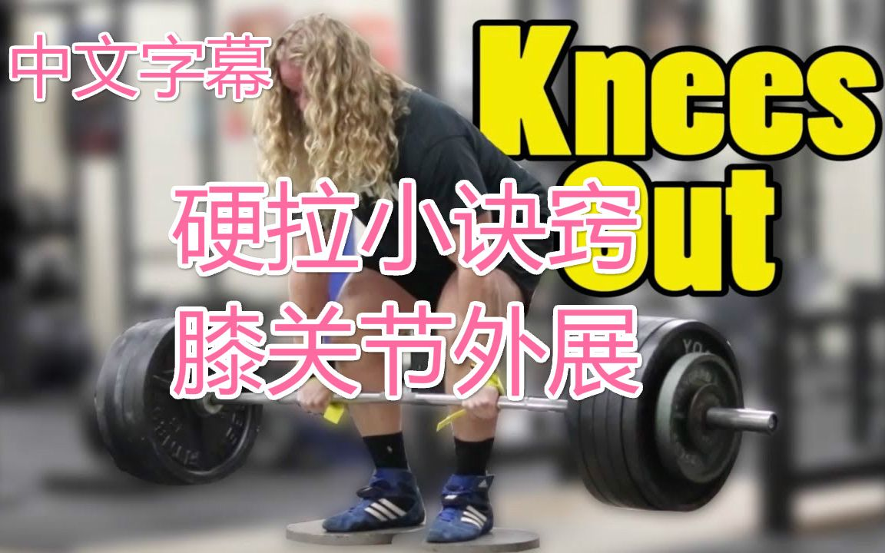

# 个人译制:原创中文翻译健身视频与计划

## 一、视频部分 ( 点击图片即可跳转播放视频 )

### Youtube上最好的相扑硬拉教程(Ft. Calgary BarBell)

[**【视频地址】**](https://www.bilibili.com/video/av30723474/)

### 奥运举重冠军的推荐：5个动作改善肩关节灵活度丨Oleksiy Torokhtiy

[**【视频地址】**](https://www.bilibili.com/video/av30406404/)

### 胡子哥硬拉小诀窍：膝关节外展丨Alan Thrall

[**【视频地址】**](https://www.bilibili.com/video/av29282107/)

### 假扮肥宅挑战街健大咖丨美国肌肉沙滩恶作剧

[**【视频地址】**](https://www.bilibili.com/video/av29579573/)

### 69岁的力量举冠军人生：Rudy Kadlub

[**【视频地址】**](https://www.bilibili.com/video/av28690935/)

## 二、计划部分

###1. KIZEN - Infinite Off Season
#### 前言
计划翻译自:**https://kizentraining.com/p/infinite-off-season**
这个计划的诞生离不开**Omar Isuf, Silent Mike, Bart Kwan, Nigel Morton**的努力，向他们的无私奉献表示感谢。

#### 计划适用人群
这个计划适用于所有初中级的训练者。

如果你有至少一年以上的训练经验，深蹲没有**500磅(226KG)**，硬拉没有**600磅(272KG)**，这个计划应该对你来说非常有效。(这句话作者说的)
#### 计划内容
这是一个一周四分化训练的计划，分为深蹲、硬拉、卧推、杠铃推举。你也可以把它看做上下肢两分化，每周两次上下肢循环。

你将一周做**2**次深蹲、硬拉、卧推。

每个训练日你需要先将上述四个动作做**3X5**，然后通过一个**AMRAP**(*As Many Reps As Possible*)组，即最大次数组，来预估你的进步情况，Excel会自动调节下一周的重量百分比。

每个训练日你都需要做这四个动作的可选变式动作来增强你的四个动作，这些动作不是强制选择的，你可以在Excel内自由更改。变式动作的重量将不是给定的，这需要你用**RPE**来自己选择当日重量。

关于KIZEN - Infinite Off Season计划的更多详细内容请[**点击此处**](programs/KIZEN)